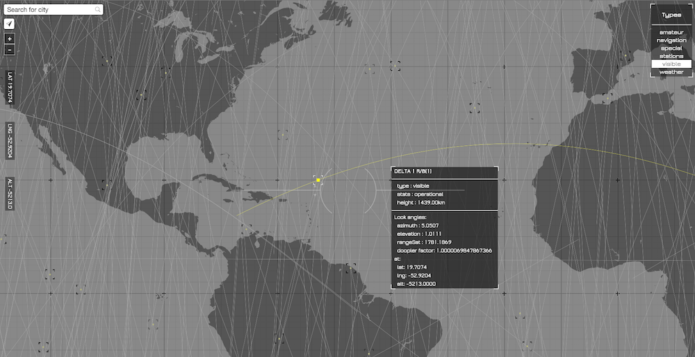

# Line of Sight

## Resources

* [OpenStreetMap](http://www.openstreetmap.org/): vector tile data
* [Leaflet](http://leafletjs.com/): JavaScript library for interactive maps
* [Tangram](https://mapzen.com/projects/tangram): 2D/3D WebGL map engine
* [Tangram Style](http://tangrams.github.io/tangram-play/?style=https://raw.githubusercontent.com/patriciogonzalezvivo/NonVisiblePaths/gh-pages/scene.yaml)
* [Stallite-js](https://github.com/shashwatak/satellite-js) for predicting the ISS orbit
* http://www.nesdis.noaa.gov/index.html
* http://www.celestrak.com/NORAD/elements/master.asp

## Install a local version of this project

Start a web server in the repo’s directory:

    python -m SimpleHTTPServer 8000
    
If that doesn’t work, try:

    python -m http.server 8000
    
Then navigate to: [http://localhost:8000](http://localhost:8000)