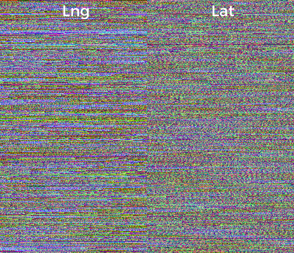
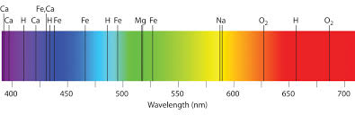

# Line of Sight

See what satellites are in your line of sight.

## How it works?

- Go to the area you are interested in. You can do that by panning, clicking on the auto-location button or searching for a city.


- Double check your position and elevation


- Zoom out until you see the satellites' orbits and hover over them


 - By clicking on the orbits or waiting a second, more information will show telling you what are the angles (azimuth and elevation) you should look at. Together with some information about the range and doppler factor.


## What’s happening behind it

This project use [Mapzen](https://mapzen.com/)’s 2D/3D map rendering engine ([Tangram.js](https://mapzen.com/projects/tangram)) which use [OpenStreetMap](http://www.openstreetmap.org/) data set through [Mapzen](https://mapzen.com/)’s [vector tiles service](https://mapzen.com/projects/vector-tiles)) to compose a scene. Usually this maps are static. In order to produce smooth animations on them we have to code it on the Fragment Shader. Yes, Tangram give you access to reprogram the GPU on the fly and modify pixel by pixel. Pretty awesome, right?

To load the satellites first I construct the orbits paths for the next hour using making different calls to the library [Satellite-js](https://github.com/shashwatak/satellite-js). 

```javascript
function getSatellitePositionAt(satiric, date) {
    var position_and_velocity = satellite.propagate(satiric,
                                                    date.getUTCFullYear(), 
                                                    date.getUTCMonth() + 1,
                                                    date.getUTCDate(),
                                                    date.getUTCHours(), 
                                                    date.getUTCMinutes(), 
                                                    date.getUTCSeconds());

    var position_eci = position_and_velocity[“position”];
    var gist = satellite.gstimeFromDate(date.getUTCFullYear(), 
                                           date.getUTCMonth() + 1, // Note, this function requires months in range 1-12. 
                                           date.getUTCDate(),
                                           date.getUTCHours(), 
                                           date.getUTCMinutes(), 
                                           date.getUTCSeconds());
    // Geodetic
    var position_gd = satellite.eciToGeodetic(position_eci, gmst);

    // Geodetic coords are accessed via “longitude”, “latitude”.
    return { 
                t:  Math.round(date.getTime()/1000), 
                ln: satellite.degreesLong(position_gd[“longitude”]), 
                lt: satellite.degreesLat(position_gd[“latitude”]),
                h:  position_d.height
            };
}
```

In order to predict the satellites positions [Satellite-js](https://github.com/shashwatak/satellite-js) require the satellites TLEs codes. This are two lines code with the position, orientation, velocity and shape of the orbit and looks like this:

```
ISS (ZARYA)
1 25544U 98067A   15312.38056839  .00011508  00000-0  17578-3 0  9990
2 25544  51.6445  84.4263 0006751 119.1634 352.3634 15.54897715970473
```

Where you can found them? Well they are public knowladge (very important to prevent things crashing on to them), you can found them on [CelesTrak](http://www.celestrak.com/NORAD/elements/master.asp).

There are more than 1700 satellites out there ([see the complete list here](http://patriciogonzalezvivo.github.io/LineOfSight/?load=all&type=visible)
) so I [curate a selection of 500 of them](http://patriciogonzalezvivo.github.io/LineOfSight/?type=visible) in order to load the page faster (is not the same to call ```satellites.js``` 1700 times than 500 right? ).

Once the future position of the orbits are calculated I make a geoJson lines and load them to Tangram. This will be the support geometry for the satellites orbits as well as the current position display. How Tangram animate the moving satellites targets? Well that’s a little more mystical. Instead of updating Tangram at 30fps (which will be very expensive to do) I save all the future positions into a texture. Each satellite have a row in that texture to look at. Using the time of the computer each satellite looks to the right position on his own line to know which is their current and next position making a nice interpolation between them.

  

The poetic twist of this is that because of the limited precision on images I have to encode each number in colors, a poetically close concept of [stellar spectra](http://hubblesite.org/laserart/spectra.php) what astronomers infer the composition of a star 

[](http://hubblesite.org/laserart/spectra.php)

## Resources

This project was made 100% using open software and data.

Libraries:

* [Leaflet](http://leafletjs.com/): JavaScript library for interactive maps
* [Tangram](https://mapzen.com/projects/tangram): 2D/3D WebGL map engine
* [Satellite-js](https://github.com/shashwatak/satellite-js) for predicting the ISS orbit.

Data sources:
* [OpenStreetMap](http://www.openstreetmap.org/): vector tile data
* [CelesTrak](http://www.celestrak.com/NORAD/elements/master.asp) satellite codes
* [Mapzen’s vector tiles](https://mapzen.com/projects/vector-tiles)
* [Mapzen’s elevation data](https://mapzen.com/documentation/elevation/elevation-service/)
* [Mapzen’s geo search](https://mapzen.com/projects/search)
* [SatNOGS transmitters for satellite](https://satnogs.org/)

## Install a local version of this project

Start a web server in the repo’s directory:

```bash
python -m SimpleHTTPServer 8000
```   
 
If that doesn’t work, try:

```bash
python -m http.server 8000
```

Then navigate to: [http://localhost:8000](http://localhost:8000)

## About the author

**Patricio Gonzalez Vivo** (Buenos Aires, 1982) is a New York based artist and engineer. He explores interstitial spaces between organic and synthetic, analog and digital, individual and collective.

Patricio studied and practiced psychotherapy and expressive art therapy. He holds an MFA in Design & Technology from Parsons The New School, where he now teaches. Currently he works as a Graphic Engineer at Mapzen making open-source mapping tools.
